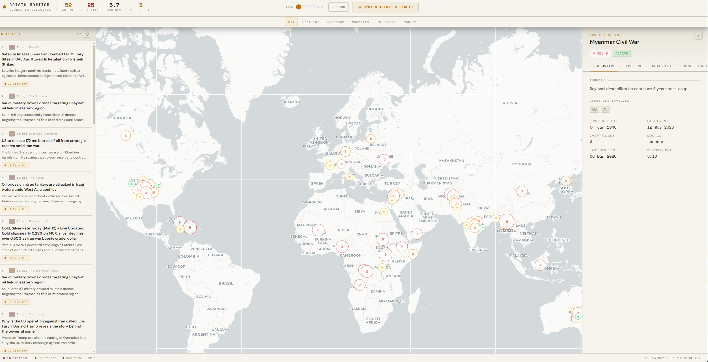
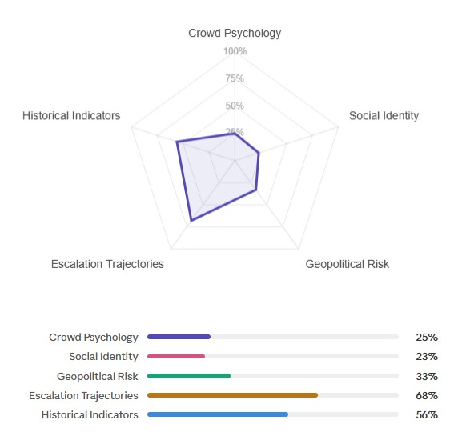

# HASE

**Hybrid Agentic Surveillance and Evaluation**



**Link dashboard-** https://hybridagenticsurveillance.vercel.app/

A multi-agent system for real-time monitoring of global crises. 8 autonomous agents perceive, understand, and reason, with a dedicated agent that monitors overall system health. Combining deterministic Python validation, LLM reasoning, RAG academic frameworks, and web search.

> **Note:** HASE is a hybrid system combining deterministic Python validators with LLM reasoning. Due to the probabilistic nature of language APIs, a 100% perfect handling of information is not guaranteed. The system includes multiple validations and cross-audits to mitigate errors, but it is designed to support human analysis, not replace it.
>
> **Planned evolution:** Performance would improve significantly by replacing journalistic sources (which introduce editorial bias) with structured and neutral feeds.

---

## Table of Contents

- [Architecture](#architecture)
- [Pipeline Flow](#pipeline-flow)
- [Execution Cadences](#execution-cadences)
- [Tech Stack](#tech-stack)
- [What the Dashboard Shows](#what-the-dashboard-shows)
- [RAG — Academic Knowledge Base](#rag--academic-knowledge-base)
- [Database](#database)
- [Costs](#costs)
- [Protection Systems](#protection-systems)
- [Project Structure](#project-structure)
- [Author's Notes](#authors-notes)

---

## Architecture

```
1. PERCEPTION
   Scanner (Sonnet + web search) --> ValidatorC --> crises
   Collector (GNews API)         --> raw_articles
                        ▼
2. UNDERSTANDING
   Classifier (Haiku)  --> Sonnet audit --> classified_events
         ▼
   ValidatorA (Python)
         ▼
   Matcher (Sonnet)    --> Sonnet audit --> crises + crisis_events
         ▼
   ValidatorB (Python, auto-merge duplicates)
         ▼
   Connector (Haiku)   --> Sonnet audit --> connections
                        ▼
3. INTELLIGENCE
   Analyst  (Sonnet + RAG)              --> analyses + key_timeline
   Verifier (Sonnet + Web Search + RAG) --> verification_log + crises
                        ▼
4. META
   Supervisor (Python + Sonnet) --> cm_supervisor_log
   Monitors all 7 agents ↑
```

---

## Pipeline Flow

### 1. PERCEPTION

**Scanner (Agent 00)** Searches for new crises worldwide via web search. Sonnet performs 3-4 web searches, synthesizing results into structured JSON. ValidatorC filters in two passes: first discards crises older than 90 days, then Haiku verifies they are real and active (not historical or speculative). SeedWriter persists to DB. Runs weekly.

**Collector (Agent 01)** Collects news from GNews API across 5 categories: conflicts, disasters, politics, health, top headlines. No LLM, pure HTTP with URL deduplication. Produces 30-44 articles per run. Runs every 6 hours.

### 2. UNDERSTANDING

**Classifier (Agent 02)** --> Receives raw articles and transforms them into structured events. Haiku reads each article and decides: is this a crisis? If so, it fills in type, severity (1-10), countries involved with roles, location, keywords. Sonnet audits each batch and sends only corrections (not the full output). Python applies corrections, validating that type and severity are DB-allowed values. Processes in batches of 15.

**ValidatorA** --> Python checkpoint: verifies required fields, ISO-2 country codes, severity in range 1-10, valid type. Organization codes (EU, NATO, G7, OPEC) are remapped to the first real country in the event. Hard fail blocks the event, soft fail logs and lets through.

**Matcher (Agent 03)** --> For each event decides: does it belong to an existing crisis, is it a new crisis, or is it a duplicate? Sonnet reasons on context, country overlap alone is not enough. Python validates 6 things before every write: does the crisis_id exist in DB? Does the event_id exist? Is severity between 1-10? Is the status canonical? Is the type valid? Is the source allowed? Crisis severity is recalculated as the median of the last 48h of events.

**ValidatorB** --> Detects duplicate crises: same country, same type, similar name (>80% overlap). If confirmed, performs auto-merge: moves events and connections from the duplicate to the original, then deletes the duplicate.

**Connector (Agent 04)** -->Analyzes all active crises and maps country-to-country relationships across 8 types: military attack, sanction, trade cut, aid, alliance, disruption, refugee flow, diplomatic break. Each run regenerates everything from scratch and diffs against the DB: new connections inserted, existing ones updated, missing ones deactivated. Sonnet audits and removes weak ones.

### 3. INTELLIGENCE

**Analyst (Agent 05)** -->Produces in-depth analyses for crises with severity ≥ 7: evolution scenarios with probabilities, historical precedents, key actors, indicators to watch. Uses RAG with 8 academic documents on conflict theory, escalation, and crisis management. Only analyzes crises with new events since the last analysis. Max 3 per run. Sonnet evaluates quality; if the score is below 5, the analysis is discarded.

**Verifier (Agent 06)** --> Verifies the real status of crises through fresh web search. Detects resolutions, escalations, de-escalations, and media gaps (the crisis is real but the media stopped covering it). Uses RAG with academic frameworks (Fink model and PCMP) to classify the crisis phase. Max 3 verifications per day with 60 seconds pause between each.

### 4. META

**Supervisor (Agent 07)** --> Two phases. Python calculates objective metrics from 30 days of runs: success rate, error trend, input/output ratio, costs per agent. Then a single Sonnet call analyzes those numbers and looks for systemic patterns: performance drift, correlations between agents, cost anomalies, agents producing zero output. Produces health scores, verdicts, and fix recommendations for each agent.

---

## Execution Cadences

| Cadence | Pipeline | Agents | Command |
|---------|----------|--------|---------|
| Every 6h | Enrichment | 01→02→03→04 | `python run.py pipeline` |
| Daily | Deep Analysis | 05 (severity ≥ 7) | `python run.py analyze` |
| Weekly | Discovery | 00 (web search) | `python run.py scan` |
| Monthly | Verification | 06 (max 3/day) | `python run.py verify` |
| After each full run | Monitoring | 07 (meta-audit) | `python run.py supervise` |
| All together | Full | 01→02→03→04→05→06→07 | `python run.py full` |

A typical full run processes 30-44 articles in ~12 minutes at a cost of ~$1.00.

---

## Tech Stack

| Component | Technology | Role |
|-----------|-----------|------|
| Backend | Python 3.12 | Orchestration, validation, pipeline |
| LLM (reasoning) | Claude Sonnet 4 | Matching, analysis, verification, audit, pattern detection |
| LLM (classification) | Claude Haiku 4.5 | Event classification, connections, reality check |
| Web Search | Anthropic Web Search API | Scanner and Verifier, fresh data from the web |
| Database | Supabase (PostgreSQL) | 12 tables, RLS, real-time subscriptions |
| News Feed | GNews API | 5 query categories, ~40 articles per run |
| RAG | Custom knowledge base | 8 academic documents, 109 chunks, relevance scoring |
| Frontend | React (Vite) + Recharts | Monitor dashboard + architecture schema |
| Cost Tracking | Thread-safe CostTracker | Cost per call, per agent, per run |
| Logging | 3 consolidated files/day | pipeline, analysis, system |

### Why Two LLM Models

Sonnet for tasks requiring contextual reasoning (deciding whether an event is a new or existing crisis, analyzing scenarios, finding patterns). Haiku for structured and mechanical tasks (classifying an article into fixed fields, listing country relationships). Haiku cost is ~4x lower than Sonnet with equivalent results on simple tasks.

---

## What the Dashboard Shows

### Crisis Map
Each active crisis is positioned on the map via the primary country's coordinates. Color indicates type (conflict, disaster, economic, political, health), size reflects severity.

### Country Relationships
Lines connecting pairs of countries with active relationships. Each line has a type (military attack, sanction, aid, refugee flow, etc.) and a strength from 1 to 10. These relationships are regenerated every 6 hours, they are not static. If a ceasefire is signed, the connection is automatically deactivated on the next run.

### Crisis Timelines
Each crisis has a timeline of turning points: the moments that changed its trajectory. It is not a list of all events, only the key milestones selected by the Analyst or Scanner. Max 8 entries per crisis.

### Deep Analyses
For crises with severity ≥ 7, the Analyst produces a report including: evolution scenarios with estimated probabilities, comparable historical precedents, key actors, and indicators to watch. These reports are powered by RAG. The Analyst does not invent theories, it applies them from real academic frameworks (Fink, PCMP, escalation theories).

### System Monitor
The Supervisor tab shows: overall pipeline health status (stable/degrading/critical), score per agent (0-100), error trends, Supervisor notes with recommendations. If an agent has fewer than 3 runs, it shows "LOW DATA" instead of a potentially misleading score.

### Monthly Verification
The Verifier checks whether crises are still active by searching for fresh information on the web. The result can be: still active, resolved, escalation, de-escalation, or insufficient data. It also detects "media gap", when a crisis is real but the media stopped covering it.

### Status Labels
Each crisis has a status updated by the Matcher and Verifier:

- **active** --> ongoing crisis, dynamic situation
- **escalating** --> worsening underway, severity increasing
- **de_escalating** --> improvement underway, signs of de-escalation
- **stable** --> persistent crisis with no significant changes
- **resolved** --> crisis concluded

These statuses are not static. Every 6 hours the Matcher can update the status based on new events. Every month the Verifier rechecks via web search and can change it. The system also handles LLM-"invented" statuses: if Sonnet returns "potentially_de_escalating" or "worsening", Python automatically normalizes it to the correct canonical status before writing to the DB.

### Media Gap
The Verifier detects a particular condition: the **media gap**. It occurs when a crisis is still active but the media stopped covering it. The Verifier marks `media_gap = true`, meaning the absence of news does not equal resolution. The crisis remains monitored.

### Dynamic Severity
A crisis severity is not a fixed number. It is recalculated as the median of events from the last 48 hours. If 5 events arrive with severity 3 and one with severity 9, the crisis does not jump to 9, the median stabilizes it. The system also tracks `severity_peak`: the highest value ever recorded, useful for understanding how severe the crisis was at its worst.

---

## RAG — Academic Knowledge Base


HASE integrates a RAG (Retrieval-Augmented Generation) system based on 8 academic documents, parsed into 109 thematic chunks. It does not use vector embeddings, it uses a custom retriever with keyword scoring.

### Documents

| Document | Topic | Primary Agent |
|----------|-------|---------------|
| RAG_01 | Crowd Psychology (Reicher 2001) | Analyst |
| RAG_02 | Mass Panic (Fletcher & Aunger 2024) | Verifier |
| RAG_03 | Early Warning Evolution (Muggah 2022) | Scanner |
| RAG_04 | LLMs and Conflict Forecasting (Nemkova 2025) | Scanner |
| RAG_05 | Early Warning → Early Action (ICG 2016) | Scanner |
| RAG_06 | Escalation Dynamics (Douglass 2024) | Analyst |
| RAG_07 | Crisis Management Framework (Crandall 2009) | Verifier |
| RAG_08 | Crisis Management Process (Vasickova 2019) | Verifier |

### How Retrieval Works

Each chunk is evaluated with a score based on:
- Primary document for the requesting agent (+3)
- Matching agent tag (+1)
- Crisis type keyword (+2 per match)
- Crisis status keyword (+1 per match)
- Extra keywords passed by the agent (+1 per match)

Chunks are sorted by score, deduplicated, and returned up to the configured maximum per agent (Analyst: 4 chunks, Scanner: 3, Verifier: 3).

### Why RAG and Not Just LLM

Without RAG, the Analyst would produce analyses based solely on the model's internal knowledge. With RAG, it applies specific academic frameworks: Fink's model (prodromal → acute → chronic → resolution), Vasickova's PCMP, Douglass's escalation theories. The result is analysis anchored in real literature, not generic reasoning.

### Thematic Branches

The knowledge base is organized around five thematic branches that together cover the full spectrum of crisis dynamics, from individual and collective behavior to geopolitical risk and conflict management frameworks.

**Crowd Psychology** --> How people behave when they find themselves in a group during a crisis. Mass panic, emotional contagion, and why crowds are not chaotic but follow precise social logics. Essential for understanding what happens on the ground when an event breaks out.

**Social Identity** --> The psychological mechanism by which people stop reasoning as individuals and start reasoning as members of a group: ethnicity, faction, religion, party. Explains why in certain conflicts people follow leaders or take actions they would never take alone.

**Geopolitical Risk** --> The tools and indices that measure how at risk a country or region is of conflict. Systems that collect data on violence, fatalities, media tone, and political stability to signal that a situation is deteriorating.

**Escalation Trajectories** --> How a crisis evolves over time, whether it intensifies, stabilizes, or de-escalates. Includes crisis phases (latent → acute → chronic), behaviors that lengthen or shorten a crisis, spillover patterns between countries, and proxy wars. This is the operational core of the knowledge base.

**Historical Indicators** --> The historical and structural signals that precede a conflict: regime type, history of instability, elite fragmentation, behavior of security forces, conflicts in peripheral areas. These are long-term indicators, not immediate events.

---

## Database

12 tables on Supabase (PostgreSQL), divided into 4 domains:

**Raw Data**
- `raw_articles` --> GNews articles with processing status
- `cm_collection_log` --> metadata for each collection (articles, API calls, cost)

**Processed Data**
- `classified_events` --> structured events with type, severity, countries, location
- `crises` --> active crises with status, severity, countries, coordinates, summary
- `crisis_events` --> event↔crisis links with severity and status over time
- `connections` --> country relationships with type, strength, direction
- `analyses` --> deep analysis reports with scenarios and precedents
- `key_timeline` --> crisis turning points
- `verification_log` --> monthly verification results with before/after
- `validation_errors` --> issues detected by validators A and B

**Pipeline Monitoring**
- `cm_agent_runs` --> per-agent run tracking (duration, cost, input/output, errors)
- `cm_supervisor_log` --> system audit with scores, verdicts, and findings

---

## Costs

### Per Model

| Model | Input ($/1M tokens) | Output ($/1M tokens) |
|-------|--------------------|--------------------|
| Claude Sonnet 4 | $3.00 | $15.00 |
| Claude Haiku 4.5 | $0.80 | $4.00 |

### Per Agent (typical full run)

| Agent | Model | Cost |
|-------|-------|------|
| Collector | None (HTTP) | $0.00 |
| Classifier | Haiku + Sonnet audit | $0.06-0.12 |
| Matcher | Sonnet + Sonnet audit | $0.35-0.45 |
| Connector | Haiku + Sonnet audit | $0.35-0.50 |
| Analyst | Sonnet + RAG | $0.40-0.55 |
| Verifier | Sonnet + Web Search + RAG | $0.90-1.15 |
| Supervisor | Sonnet | $0.02-0.04 |
| **Total per run** | | **~$0.95-1.20** |

### Monthly Projection

| Frequency | Runs/month | Cost/month |
|-----------|-----------|------------|
| 1 full run/day | 30 | ~$30-36 |
| 3 full runs/day | 90 | ~$90-108 |

Using Haiku for Classifier and Connector saves ~$0.60 per run compared to using Sonnet exclusively.

---

## Protection Systems

### Pre-write Validation
No data touches the database without passing Python validation. Each agent has a chain of specific checks before every INSERT:

- **Severity** --> clamped to 1-10 at every write point
- **Status** --> normalized from 12+ LLM variants to 5 canonical DB values
- **Crisis type** --> validated against 5 allowed values (conflict, disaster, economic, political, health)
- **Source** --> validated against DB constraint allowed values
- **Foreign key** --> crisis_id and event_id verified before every INSERT into crisis_events
- **Country codes** --> ISO-2 validated, placeholders (EU, NATO, G7, OPEC, ASEAN) remapped to first real country

### Cross-audits
Every agent using an LLM has a second LLM (Sonnet) auditing the output before saving. The Classifier uses a compact corrections-only format: Sonnet doesn't rewrite everything, it only flags errors. The corrections themselves are validated: if Sonnet suggests an invalid type like "social" or "cyber", Python blocks it.

### Malformed JSON Handling
LLMs don't always produce valid JSON. Every agent has progressive fallbacks:
1. Standard parse
2. Markdown fence stripping
3. Regex extraction of the first valid JSON object
4. Progressive trimming of trailing garbage
5. Fallback to original unaudited output

The system never crashes on malformed JSON, it degrades gracefully.

### Rate Limit Protection
- Verifier: 60-second pause between each verification
- Max 3 verifications per day
- Automatic retry on 429 error with 60-second wait
- All agents: retry up to 4 attempts with exponential backoff (90s × attempt)
- API overload (529): 30s × attempt backoff

### Duplicate Protection
- ValidatorB detects duplicate crises (same country + type + similar name >80%)
- Auto-merge: moves all data from the duplicate to the original, then deletes
- The Matcher also checks for intra-run duplicates (same crisis created twice in the same session)

### DB Constraints
The database has CHECK constraints on all critical fields. If an invalid value were to slip past all Python checks, the DB rejects it as the last line of defense:
- `crises.status` --> only 5 allowed values
- `crises.type` --> only 5 allowed values
- `crises.source` --> only 3 allowed values
- `crisis_events.source` --> only 4 allowed values
- `severity` --> between 1 and 10 (on both crises and crisis_events)
- Foreign keys with CASCADE delete on crisis_events and connections

---

## Project Structure

```
📁 hase/
├── backend/
│   ├── agents/
│   │   ├── base_agent.py              # Base template: retry, parse JSON, web search multi-turn
│   │   ├── agent_00_scanner.py        # Perception: web search for new crises
│   │   ├── agent_01_collector.py      # Perception: GNews article collection
│   │   ├── agent_02_classifier.py     # Understanding: article → structured event
│   │   ├── agent_03_matcher.py        # Understanding: event → crisis (link or create)
│   │   ├── agent_04_connector.py      # Understanding: country relationships
│   │   ├── agent_05_analyst.py        # Intelligence: deep analysis + RAG
│   │   ├── agent_06_verifier.py       # Intelligence: status verification via web search
│   │   └── agent_07_supervisor.py     # Meta: system audit
│   ├── data/
│   │   └── country_coords.json        # 206 ISO-2 codes with coordinates
│   ├── rag/
│   │   └── RAG_01 ... RAG_08          # 8 academic documents (109 chunks)
│   ├── sql/
│   │   └── schema.sql                 # Complete DB schema (12 tables)
│   ├── run.py                         # Entry point: all commands
│   ├── bootstrap.py                   # Initial setup: seed 25 crises
│   ├── config.py                      # Constants + normalize_status()
│   ├── validators.py                  # ValidatorA, ValidatorB, ValidatorC
│   ├── utils.py                       # Re-export + RunTracker
│   ├── db.py                          # Supabase client with retry
│   ├── cost.py                        # Thread-safe cost tracking
│   ├── logger.py                      # Consolidated logging
│   ├── geo.py                         # Country geocoding
│   ├── rag.py                         # RAG retriever with scoring
│   ├── seed_writer.py                 # Scanner → DB
│   └── diagnostic.py                  # Health check
│
└── frontend/src/
    ├── main.jsx                       # React entry point
    ├── App.jsx                        # Routing
    ├── SystemPage.jsx                 # Monitor dashboard + architecture
    └── index.css                      # Global styles
```

---

## Author's Notes

HASE currently feeds from GNews, a journalistic source that carries editorial bias. A structured and neutral data source would significantly improve pipeline stability, reduce the verifications and cross-checks needed, and consequently lighten both the system and its costs.

The introduction of the academic RAG slows down execution times, but gives agents a richer context to evaluate situations. It is a conscious tradeoff: more time for more informed responses.

Due to the probabilistic nature of LLMs and other factors, the system does not guarantee 100% stability or veracity. But it is interesting to explore how far it is possible to push. After testing it for a few days I was impressed by how it handled, analyzed, and modified parameters and variables that change over time.

The Supervisor (Agent 07) does not provide return feedback to other agents. It is only an external observer that evaluates the overall system health. The choice was deliberate: I did not want to increase call costs or introduce additional verifier agents. I preferred having a general overview and a working system with the current pieces, rather than a more complex but unstable architecture.
